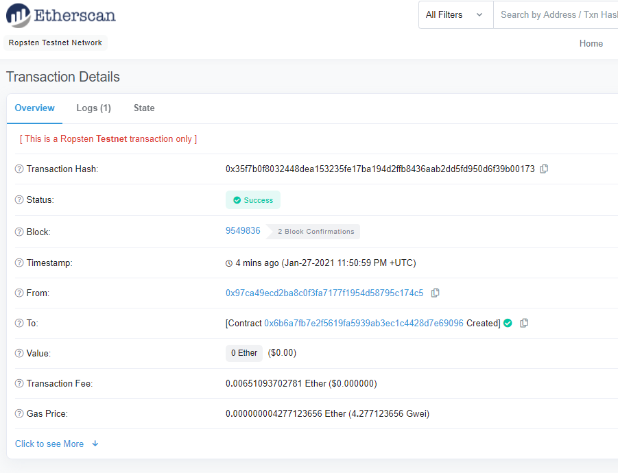

# Unit 21: You sure can attract a crowd!

## Premise

Our company has decided to crowdsale their new ERC20 token, PupperCoin, in exchange for ETH to fund further network development. We have been tasked with writing the smart contracts to facilitate the offering. The offering must be capped at a total of 300 ETH raised, be able to run for 24 weeks, and be able to refund purchases should the crowdsale be successful.

## Contracts

There are two solidity files, containing a total of three smart contracts which will provide all needed functionality for the crowdsale of tokens. PupperCoin.sol and Crowdsale.sol.
* PupperCoin.sol
    * This file contains the standard code needed for ERC20 tokens. It uses OpenZeppelin's contract caches: ERC20, ERC20Detailed, ERC20Mintable. When the contract is deployed, these smart contract functions allow for the initial enumeration of the PupperCoin, as well as setting out the minting instructions for the creation of the actual tokens to be sent to crowdsale participants.
    

* Crowdsale.sol
    * This files contains the totality of the code for, unsurprisingly, the crowdsale itself. It uses OpenZeppelin's contract caches: Crowdsale, MintedCrowdsale, CappedCrowdsale, TimedCrowdsale, RefundablePostDeliveryCrowdsale. Each one of these aptly named libraries takes parameters from the constructor function to then execute or provide the specific requirements previously stated. These functions will control everything from accepting payment for tokens, distributing newly minted tokens, tracking the time left in the crowdsale, to refunding purchases after the sale's completion.

## Usage

### Smart Contract Deployment
In order for crowdsale contracts to function accurately, smart contracts should be executed in the following order.
* Connect to the network to Kovan testnet with Metamask and MyCrypto. Pre-fund the primary address to ensure successful deployment of the contract.

* The first contract to deploy is PupperCoin (this code must be initiated first, otherwise Crowdsale.sol cannot function). Parameters required for deployment: name (PupperCoin), symbol (PUP), initial_supply (0).

 

* The second contract to deploy is PupperCoinSaleDeployer. Parameters required: name, symbol, wallet (this wallet address will hold the paid ETH/wei generated from the crowdsale) and goal (the total ETH demoninated in wei to raise via PupperCoin sales).
    * Once deployed, the contract will create Token_Address & Token_Sale_Address under the 'Deployed Contracts' tab. These addresses will be useful later.

 

* The final contract to deploy is PupperCoinSale. This needs to be done with the previously generated Token_Sale_Address in the ‘At_Address’ section beneath the standard deployment button.

 

### Token Interactions

* Buy Tokens under PupperCoinSale on Remix

 

* Validate the transaction on Etherscan

* Add Custom Tokens (PUP) to Metamask
    * Under Assets, click on Add Tokens
    * Under Add Tokens, click on Custom Tokens
    * Parameters (These will pre-populate):
        * Token Address - Token_Address
        * Name - Token_Name
        * Decimal - 18

* Metamask wallet: ETH and PUP

* View Tokens on MyCrypto Wallet
    Access your wallet address on MyCrypto to view the updated balances (You may need to add the PUP like above).

